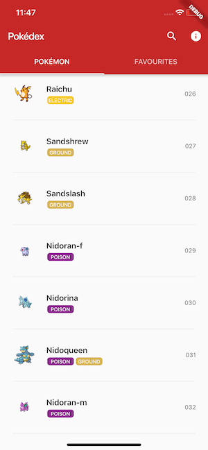
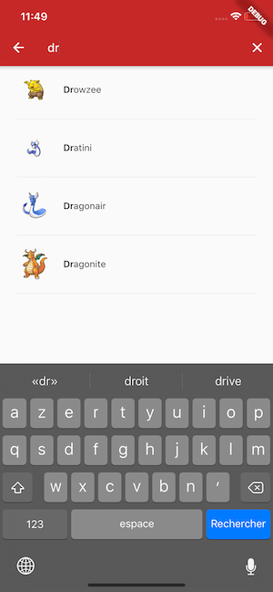
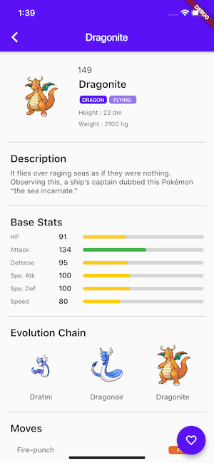

# Flutter Pokédex

A Pokédex App for iOS and Android of the 151 first Pokémons made with Flutter for educational purpose.

## App preview

## Installation

- Add [Flutter](https://flutter.dev/docs/get-started/install) to your machine

- Open this project folder with Terminal/CMD and run `flutter packages get`

- Run `flutter run` to build and run the debug app on your emulator/phone

## Special Thanks

- The [PokeAPI](https://pokeapi.co) database on which the database of this app relies through the Python script [databaseBuilder.py](./misc/databaseBuilder.py)

## License

All the code available under the MIT license. See [LICENSE](LICENSE).
